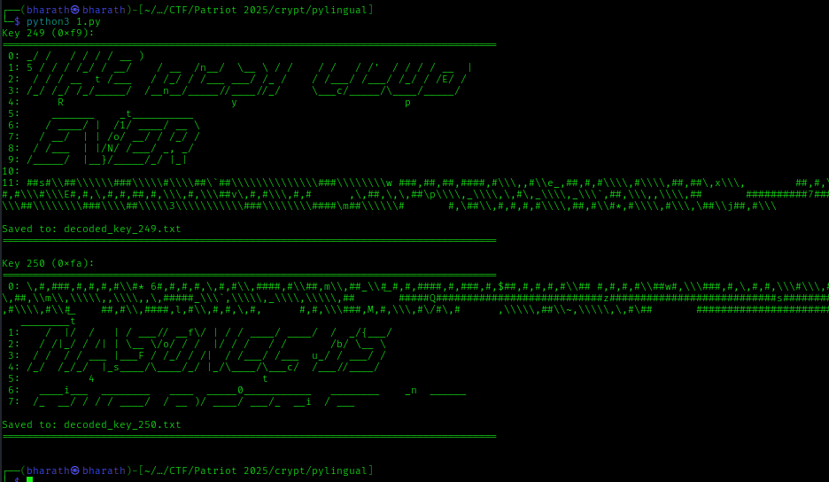

# Pylingual - CTF Writeup

**Challenge:** Pylingual  
**Category:** Cryptography / Reverse Engineering  
**Flag:** `pctf{obFusc4ti0n_i5n't_EncRypt1oN}`

## Challenge Overview

We were given an obfuscated Python bytecode file (`pylinguese.pyc`) and an `output.txt` file containing encoded data. The challenge description noted that a past MasonCC member had obfuscated Python code to make it unreadable. The goal was to recover the flag hidden in the encoded output.

## Files Provided

- `pylinguese.pyc` — obfuscated Python 3.12 bytecode (difficult to decompile with standard tools)  
- `output.txt` — a list of 512 integers (mostly negative values between -128 and -13)

## Solution Summary

Because the `.pyc` file targeted Python 3.12 and was heavily obfuscated, the quickest path was to analyze `output.txt`. The encoded data is a sequence of integers; after trying a variety of transforms (ASCII conversion, additive shifts, NOT, XOR with single-byte keys, etc.), a simple XOR with 249 (0xF9) revealed readable ASCII art that contained the flag visually.

## Steps Performed

1. Inspect files to confirm formats and content.
2. Parse `output.txt` into a Python list of integers.
3. Normalize negative values into unsigned bytes.
4. Brute-force common simple transforms (XOR keys 0..255, additive offsets, bitwise NOT, etc.).
5. Identify XOR key 249 (0xF9) as producing readable ASCII art.
6. Visually read the flag from the ASCII art output.

## Decoding Algorithm

The decoding used the following algorithm (Python):

```python
# Read the 512 integers from output.txt into `encoded_nums`,
# for example: encoded_nums = [int(x) for x in open("output.txt").read().split()]

unsigned = [(x + 256) if x < 0 else x for x in encoded_nums]
decoded = "".join(chr(b ^ 249) for b in unsigned)
print(decoded)
```

Explanation:
- Values in `output.txt` are signed integers; convert negatives to their unsigned byte equivalents by adding 256.
- XOR each byte with 249 (0xF9).
- Join the resulting characters to obtain the ASCII art which contains the flag.



## Extracted Flag

After applying the above transform and visually inspecting the ASCII art, the flag was found:

pctf{obFusc4ti0n_i5n't_EncRypt1oN}

## Key Insights

- Obfuscation is not the same as encryption. Simple obfuscation patterns (like single-byte XOR) can often be reversed by brute force and analysis.
- ZIP/bytecode obfuscation can make reversing harder, but when an encoded output is available, targeting that output is often the most efficient route.
- Single-byte XOR is trivial to brute force; trying all 256 keys and filtering for readable output is usually effective.
