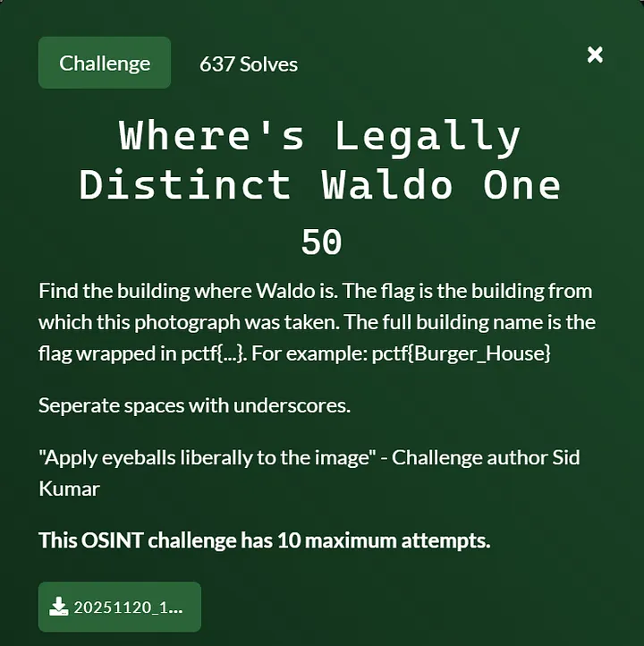
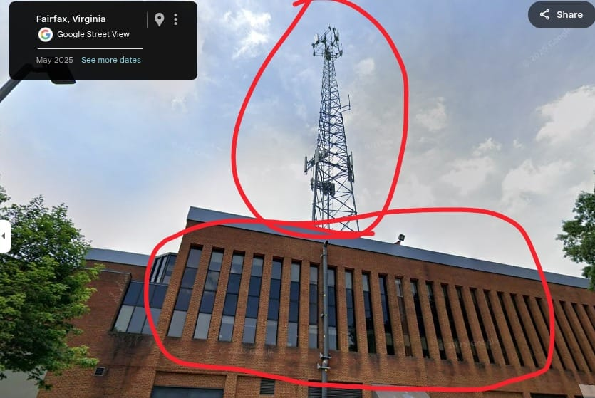
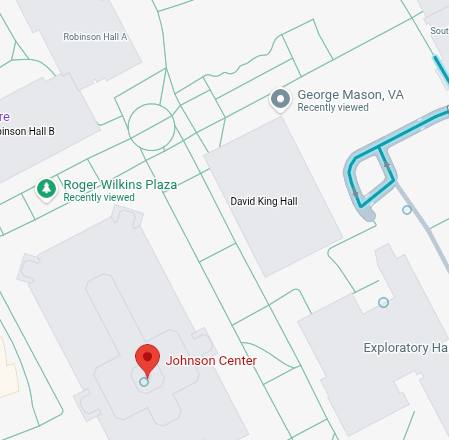
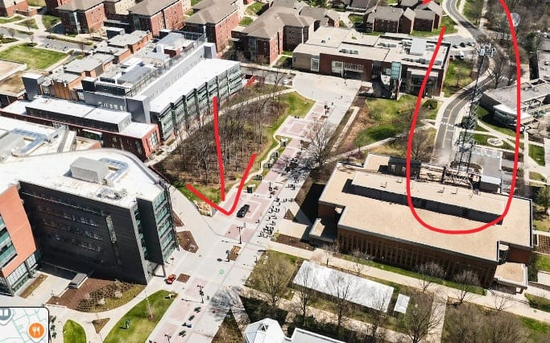
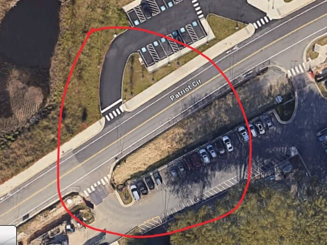
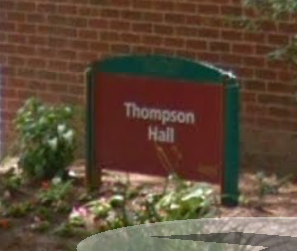
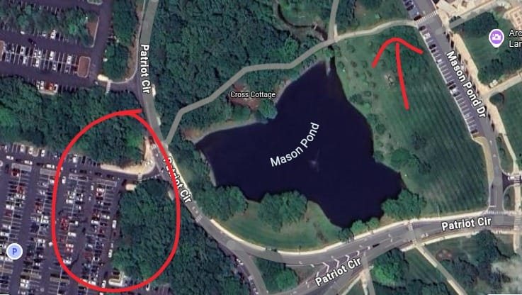
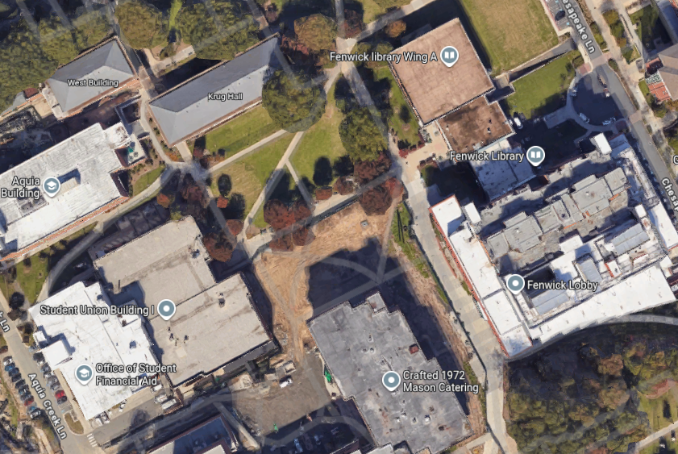

# Where’s Legally Distinct Waldo — PatriotCTF 2025 writeup

PatriotCTF 2025 featured a fun series of OSINT challenges titled "Where’s Legally Distinct Waldo" — four geolocation puzzles that required finding very specific spots on the George Mason University campus. Here’s how I solved all four of them.

---

## Challenge 1 — Where’s Legally Distinct Waldo One

Challenge image:

How I solved it

I began with a standard reverse image search, using Yandex for its superior performance in geolocation tasks.

Yandex suggested George Mason University, which narrowed down the search area significantly. 

While Yandex didn't identify the exact building, it consistently suggested George Mason University, which was enough to narrow down the search area significantly.

With a location in mind, I began a manual scan of the campus using Google Maps and Google Earth.

GMU Aerial View / Street View Network Tower

The key details in the challenge image were a distinctive tiled walking path and a prominent tower.

Distinctive Tiled Walking Path

After searching the campus on Google Maps, I found a perfect match for the path's unique design and the surrounding layout. The only tall building positioned correctly relative to both the path and a nearby brown building was Horizon Hall.

Flag: `pctf{Horizon_Hall}`

---

## Challenge 2 — Where’s Legally Distinct Waldo Two

Challenge image:

How I solved it

What immediately stood out to me were the distinctive roof panels.

I began searching from an aerial view, looking for buildings with similar roof panels.

I pulled the location up on Google Earth to confirm:

A "No Parking" sign on the road and the name of the crossroad confirmed it was the correct place.

I then took a virtual walk via Street View and found this sign on the side of the building:

Flag: `pctf{Thompson_Hall}`

---

## Challenge 3 — Where’s Legally Distinct Waldo Three

Challenge image:

How I solved it

Since the first two challenges were on GMU’s campus, I continued searching there. This time, the giveaway was obvious: a lake or pond.

This was one of the easiest challenges.

The challenge image also showed a large parking lot:
From the correct angle on Google Maps, everything matched—the parking layout, trees sidewalks.

This view pointed directly to the building in the background.
I went to Street View to confirm the building's exact name and found the sign:

It was the "Center for the Arts / Concert Hall."

After a few attempts at formatting the name correctly, the accepted flag was:

Flag: pctf{Center_for_the_Arts_Concert_Hall}

Flag: `pctf{Center_for_the_Arts_Concert_Hall}`

---

## Challenge 4 — Where’s Legally Distinct Waldo Four

Challenge image:

How I solved it
This one took a long time and was definitely the hardest of the four.

Again, I assumed it was somewhere on the GMU campus. This time, the only clues were partial views of three buildings:

The distinctive trio consisted of:

A one-piece gray block structure.

An orange-ish building.

A black-ish building with vertical lines.

I spent 2–3 hours scanning the campus for this specific combination. The closest matches were near the Fenwick area or Krug Hall, so I began analyzing small structural details—zooming in to compare window spacing, roof edges, and any other distinctive features.

I initially gave up, but later I examined a 360-degree view from above the Johnson Center.

https://maps.app.goo.gl/DvCthseVXvcsDLrXA

I had noticed this spot earlier but dismissed it too quickly. Upon my second review, I found the exact match:

FINALLY!!!

It was a perfect match. The location was indeed Krug Hall.
Flag: `pctf{Krug_Hall}`

---
