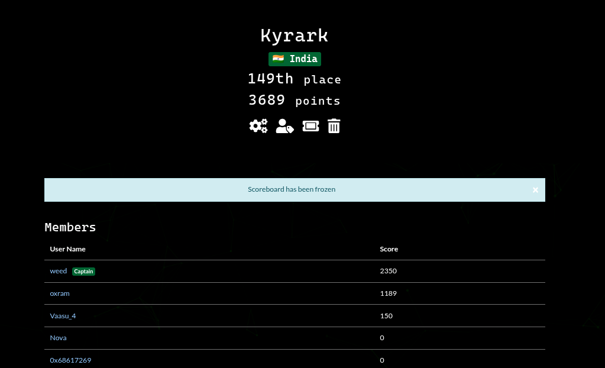
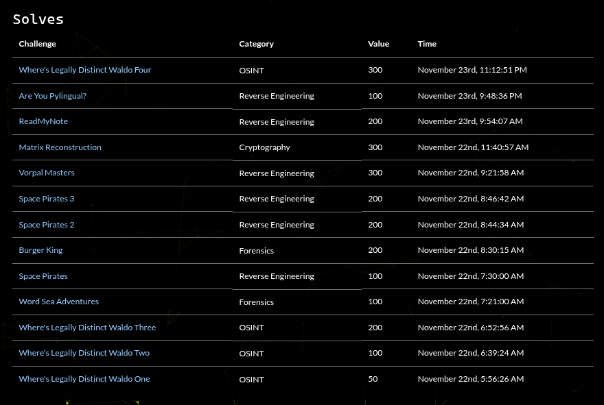

# Patriot CTF 2025 Writeups

A concise collection of my writeups from Patriot CTF 2025 (Nov 22–24, 2025).

- Author: BharathHonnappa / weed  
- Team Rank: 149 / 1369  
- Team: Kyrark

## Overview
This repo contains challenge writeups I completed during the 48-hour event. Each writeup documents the approach, tools used, and the final result.

## Team Results & Acknowledgements
- Final Rank: **149 / 1369**  
- Big thanks to the organizers at **George Mason University** for running a great CTF.

I solved 13 challenges. 
out of wch 
OSINT - 4
Crypto - 1
Forensics - 2
Rev - 4

## Weekend Recap
A packed Saturday and Sunday of brainstorming and iterative solving — lots of learning and fun collaboration.

This repository is for educational purposes only. All solutions are my own.

---
Contact: https://bharathh.vercel.app
